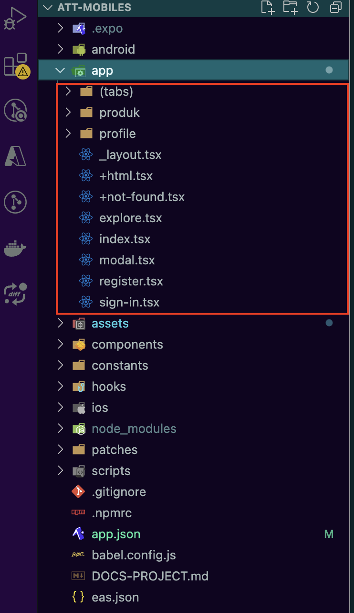

# Mobile App React native With Expo and Gluestack-UI 👋

This is an [Expo](https://expo.dev) project created with [`create-expo-app`](https://www.npmjs.com/package/create-expo-app).

## Plugins
Below some of plugins are use in this project, But its not all use in this app, Any plugins just a recomendations:

| Plugin           | README                                                                                                               |
| ---------------- | -------------------------------------------------------------------------------------------------------------------- |
| gluestack-ui       | [https://gluestack.io/ui/docs/home/overview/introduction] is uses for template and components UI layouts       |
| tailwind-rn       | [https://www.npmjs.com/package/tailwind-rn/v/3.0.1] is uses Tailwind CSS as scripting language to create a universal styling system |
| nativewind       | [https://www.nativewind.dev/overview/] is uses Tailwind CSS as scripting language to create a universal styling system |
| Ionicons         | [https://iconduck.com/sets/ionicons] Icon of apps                                                                    |
| Expo             | [https://expo.dev/] Universal native apps with React that run on Android, iOS, and the web. Iterate with confidence. |
    

1. Create Project with expo

   ```sh
   npx create-expo-app@latest
   ```

2. Inititate gluestack-ui

   ```sh
    npx gluestack-ui init
   ```
3. Instal any Component gluestack-ui, like 

   ```sh
    npx gluestack-ui add box
    npx gluestack-ui add button
    etc..
   ```
4. Run Project

   ```sh
    npx expo start
            OR
    npx expo run:android
    npx expo run:ios
   ```

5. Install **Tailwind CSS IntelliSense** in vscode, also install **gluestack** plugins

6. Edit **settings.json** in vscode by command+shift+p , then type **preferences** in the box search. **sometime you can skip this** in these step its works

```sh
  {
    "tailwindCSS.experimental.classRegex": [
      ["tva\\((([^()]*|\\([^()]*\\))*)\\)", "[\"'`]([^\"'`]*).*?[\"'`]"]
    ]
  }
   ```
7. We can Use **Component Snippets** with keyword **gs-** and then followed by the name of the desired component . like below:

   


<br> <br> <br>

## BUILD APP
<br> 

>
### Build app ready for upload to playstore
- Install **eas** in computer
```sh
   npm install -g eas-cli
```
- Build app with aab file. It will rebuild .aab file in expo dashboard for android
```sh
   eas build --platform android
            OR
   eas build --platform ios
```

### Generate App Native folder for project
A native build locally by running command below, It will generate folder **android** and **ios** for native app:
```sh
npx expo prebuild
      OR
npx expo run:android
      or
npx expo run:ios
```

> 
> 
> If we have a minor change just run **npx expo prebuild**, 
> but If We want to rebuild and change a major fresh , then use **--clean** flag

```sh
npx expo prebuild --clean
      OR
npx expo run:android --clean
      or
npx expo run:ios --clean
```
> 
> Then we have to build manual its native app by :

1. Build the **Android** APK DEBUG :

```sh 
      cd android
      ./gradlew clean
      ./gradlew assembleDebug
   ```
2. Build the **Android** APK Release :
```sh
    cd android
    ./gradlew clean
    ./gradlew assembleRelease
```


<br> <br> <br>

## ROUTER IN NAVIGATION EXPO
<br>

### Setup entry point
> For the property main, use the expo-router/entry as its value in the **package.json**. 
> The initial client file is **app/_layout.js** directory

```sh
      {
        "main": "expo-router/entry"
      }
```

### Create pages with Expo Router
When a file or Directory is created in the **app** directory, it **automatically** becomes a route . For example, the following files will create the following routes:



Depends on above structure, the file or folder inside of app directory would be a route.


<br/>

> Expo navigation consist of **\_layout.tsx** for manage navigation.
> Root navigation is located in app folder
> structure like below

```sh
    app
      _layout.tsx
```

> **File \_layout.tsx** consist of ThemeProvider like below. And its consist of Stack Screen,
> where Screen Name must consist in the same directori with file **\_layout.tsx**
> its may be consist of file or directory like below that **(tabs)** is a directory and **+not-found** is file of **+not-found.tsx**

```sh
    <ThemeProvider value={colorScheme === 'dark' ? DarkTheme : DefaultTheme}>
      <Stack>
        <Stack.Screen name="(tabs)" options={{ headerShown: false }} />
        <Stack.Screen name="+not-found" />
      </Stack>
    </ThemeProvider>
```

### Navigation Screen

> Every folder of navigation must consist of **\_layout.tsx** to manage navigation.
> for example directory **(tabs)** consist of file for manage bottom tabs menu like below:
> **index.tsx** is initial screen that running first

```sh
  (tabs)
      - _layout.tsx
      - index.tsx
      - setting.tsx
```

> If we look at **\_layout.tsx** its configure of screen navaigation.
> the **nama** is the file name. the file name its must exists in the same recent directory

```sh
      // _layout.tsx
      <Tabs
        screenOptions={{
          tabBarActiveTintColor: Colors[colorScheme ?? 'light'].tint,
          headerShown: false,
        }}>
        <Tabs.Screen
          name="index"
          options={{
            title: 'Home',
            tabBarIcon: ({ color, focused }) => (
              <TabBarIcon name={focused ? 'home' : 'home-outline'} color={color} />
            ),
          }}
        />
        <Tabs.Screen
          name="setting"
          options={{
            title: 'Settings',
            tabBarIcon: ({ color, focused }) => (
              <TabBarIcon name={focused ? 'code-slash' : 'code-slash-outline'} color={color} />
            ),
          }}
        />
      </Tabs>
```

```sh
    app
      - (tabs)
          - _layout.tsx
          - index.tsx
          - MyProfile.tsx
          - settings.tsx
      - _layout.tsx
      - +html.tsx
      - +not-found.tsx
    components
    assets
    hooks
```


<br> <br> <br>


## Use Darkmode in Project With Localstorage My Version

1. Instal asynstorage Plugins in expo
```sh
    npx expo install @react-native-async-storage/async-storage
```

2. Creat react Hooks with name **useColorsMode.ts**

```sh
    // hooks/useColorsMode.tsx

    import { useColorScheme } from "@/hooks/useColorScheme";
    import { Colors } from "@/constants/Colors";

    export function useColorsMode() {
      const colorScheme = useColorScheme();
      const text = colorScheme === 'dark' ? 'Dark Mode' : 'Light Mode';
      if (colorScheme=="dark") {
        return {
          text:Colors.dark.text,
          background:Colors.dark.background,
          tint:Colors.dark.tint,
          icon:Colors.dark.icon,
          tabIconDefault:Colors.dark.tabIconDefault,
          tabIconSelected:Colors.dark.tabIconSelected,
        };
      } else {
        return {
          text:Colors.light.text,
          background:Colors.light.background,
          tint:Colors.light.tint,
          icon:Colors.light.icon,
          tabIconDefault:Colors.light.tabIconDefault,
          tabIconSelected:Colors.light.tabIconSelected,
        };
      }
    }
```

3. Apply in Layout look like below :

```sh
    // app/_layout.tsx

      function RootLayoutNav() {
        const colorScheme = useColorScheme();
        const [datalogin, setDatalogin] = useState<any>();
        
        const getDataLogin = async () => {
          try {
            const valueLogin = await AsyncStorage.getItem('dataLogin');
            if (valueLogin !== null) {
              const dataLoginObject = JSON.parse(valueLogin);
              setDatalogin(dataLoginObject);
            }
          } catch (e) {
            setDatalogin("");
          }
        };
        
        useEffect(() => {
          setTimeout(() => {
            getDataLogin()
          }, 300);
      
        }, []);
        return (
          <GluestackUIProvider mode={datalogin?.UImode}>
            <ThemeProvider value={datalogin?.UImode === "dark" ? DarkTheme : DefaultTheme}>
              <Stack>
                <Stack.Screen name="(tabs)" options={{ headerShown: false }} />
                <Stack.Screen name="+not-found" />
                <Stack.Screen name="profile" options={{ headerShown: false }} />
            </ThemeProvider>
          </GluestackUIProvider>
        );
      }
```
4. Now we can use color dark mode in any Component screen like :

```sh
    import { useColorsMode } from "@/hooks/useColorsMode";
    export default function ProfilScreen() {
          const colorMode = useColorsMode();
          return (
            <Text style={{ color: colorMode.text }}>TEST DARK MODE</Text>
      );
  }
```


<br> <br> <br>

## TIPS & TRIK
>

### Ignore warning error in ESlint Typescript like className or etc.
1.  create directory **types** in root of project.the create file file **declarations.d.ts** and set this code :
```sh
    // declarations.d.ts
    import "nativewind/types";

    declare module "react-native" {
      interface TextProps {
        className?: string;
      }
      interface ViewProps {
        className?: string;
      }
      // Add other component types if needed (e.g., for Image, etc.)
    }
```
2. Edit file **tsconfig.json** and include these folder **"types"** like below:

```sh
    {
      "compilerOptions": {
        "strict": true,
        "moduleResolution": "node",
        "jsx": "react-native"
      },
      "include": ["types", "src"]
    }
```
