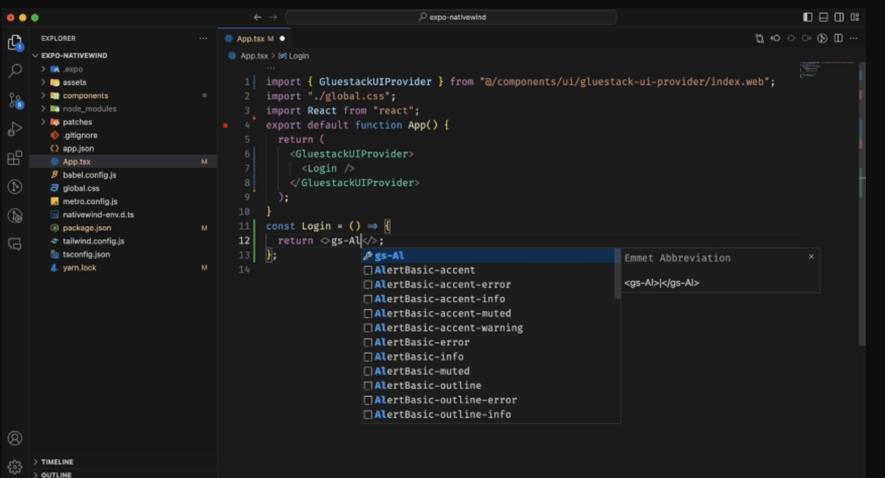

# Mobile App React native With Expo and Gluestack-UI 👋

This is an [Expo](https://expo.dev) project created with [`create-expo-app`](https://www.npmjs.com/package/create-expo-app).

## Plugins
Below some of plugins are use in this project, But its not all use in this app, Any plugins just a recomendations:

| Plugin           | README                                                                                                               |
| ---------------- | -------------------------------------------------------------------------------------------------------------------- |
| gluestack       | [https://gluestack.io/ui/docs/home/overview/introduction] is uses for template and components UI layouts       |
| tailwind-rn       | [https://www.npmjs.com/package/tailwind-rn/v/3.0.1] is uses Tailwind CSS as scripting language to create a universal styling system |
| nativewind       | [https://www.nativewind.dev/overview/] is uses Tailwind CSS as scripting language to create a universal styling system |
| Ionicons         | [https://iconduck.com/sets/ionicons] Icon of apps                                                                    |
| Expo             | [https://expo.dev/] Universal native apps with React that run on Android, iOS, and the web. Iterate with confidence. |
    

1. Create Project with expo

   ```sh
   npx create-expo-app@latest
   ```

2. Inititate gluestack-ui

   ```sh
    npx gluestack-ui init
   ```
2. Instal Component gluestack, like 

   ```sh
    npx gluestack-ui add box
    npx gluestack-ui add button
   ```
2. Install **Tailwind CSS IntelliSense** in vscode, also install **gluestack** plugins

2. Edit **settings.json** in vscode by command+shift+p , then type **preferences** in the box search


```sh
  {
    "tailwindCSS.experimental.classRegex": [
      ["tva\\((([^()]*|\\([^()]*\\))*)\\)", "[\"'`]([^\"'`]*).*?[\"'`]"]
    ]
  }
   ```
3. WE can Use **Component Snippets** with keyword **gs-** and then followed by the name of the desired component . like below:

   


## BUILD APP

## Build app ready for upload to playstore
- Instasl eas in computer
```sh
   npm install -g eas-cli
```
- Build app with aab file. It will rebuild .aab file in expo dashboard for android
```sh
   eas build --platform android
            OR
   eas build --platform ios
```

## Generate App Native folder for project
A native build locally by running command below, It will generate folder **android** and **ios** for native app:
```sh
npx expo prebuild
      OR
npx expo run:android
      or
npx expo run:ios
```

>
> If We want to rebuild and change a major fresh , then use **--clean** flag

```sh
npx expo prebuild --clean
      OR
npx expo run:android --clean
      or
npx expo run:ios --clean
```

Then we have to build manual its native app by :
```sh

1. Build the **Android** APK DEBUG :
    ```
      cd android
      ./gradlew clean
      ./gradlew assembleDebug
2. Build the **Android** APK Release :
    cd android
    ./gradlew clean
    ./gradlew assembleRelease

```


## Router Navigation In EXPO

### Setup entry point

    For the property main, use the expo-router/entry as its value in the **package.json**. The initial client file is **app/_layout.js**.

```sh
      {
        "main": "expo-router/entry"
      }
```

### Create pages with Expo Router
When a file is created in the **app** directory, it **automatically** becomes a route . For example, the following files will create the following routes:


> Expo navigation consist of **\_layout.tsx** for manage navigation.
> Root navigation is located in app folder
> structure like below

```sh
    app
      _layout.tsx
```

> **File \_layout.tsx** consist of ThemeProvider like below. And its consist of Stack Screen,
> where Screen Name must consist in the same directori with file **\_layout.tsx**
> its may be consist of file or directory like below that **(tabs)** is a directory and **+not-found** is file of **+not-found.tsx**

```sh
    <ThemeProvider value={colorScheme === 'dark' ? DarkTheme : DefaultTheme}>
      <Stack>
        <Stack.Screen name="(tabs)" options={{ headerShown: false }} />
        <Stack.Screen name="+not-found" />
      </Stack>
    </ThemeProvider>
```

### Navigation Screen

> Every folder of navigation must consist of **\_layout.tsx** to manage navigation.
> for example directory **(tabs)** consist of file for manage bottom tabs menu like below:
> **index.tsx** is initial screen that running first

```sh
  (tabs)
      - _layout.tsx
      - index.tsx
      - setting.tsx
```

> If we look at **\_layout.tsx** its configure of screen navaigation.
> the **nama** is the file name. the file name its must exists in the same recent directory

```sh
      // _layout.tsx
      <Tabs
        screenOptions={{
          tabBarActiveTintColor: Colors[colorScheme ?? 'light'].tint,
          headerShown: false,
        }}>
        <Tabs.Screen
          name="index"
          options={{
            title: 'Home',
            tabBarIcon: ({ color, focused }) => (
              <TabBarIcon name={focused ? 'home' : 'home-outline'} color={color} />
            ),
          }}
        />
        <Tabs.Screen
          name="setting"
          options={{
            title: 'Settings',
            tabBarIcon: ({ color, focused }) => (
              <TabBarIcon name={focused ? 'code-slash' : 'code-slash-outline'} color={color} />
            ),
          }}
        />
      </Tabs>
```

```sh
    app
      - (tabs)
          - _layout.tsx
          - index.tsx
          - MyProfile.tsx
          - settings.tsx
      - _layout.tsx
      - +html.tsx
      - +not-found.tsx
    components
    assets
    hooks
```


## TIPS and TRIK

### Ignore warning error in ESlint Typescript like className or etc.
1.  create directory **types** in root of project.the create file file **declarations.d.ts** and set this code :
```sh
    // declarations.d.ts
    import "nativewind/types";

    declare module "react-native" {
      interface TextProps {
        className?: string;
      }
      interface ViewProps {
        className?: string;
      }
      // Add other component types if needed (e.g., for Image, etc.)
    }
```
2. Edit file **tsconfig.json** and include these folder **"types"** like below:

```sh
    {
      "compilerOptions": {
        "strict": true,
        "moduleResolution": "node",
        "jsx": "react-native"
      },
      "include": ["types", "src"]
    }
```
